# LineDistiller
**[English]** [[中文]](#总览)

<p align="center">
 
</p>

Want to start your own illustration related model? All you need is here. LineDistiller is a data-driven **line extractor** for 2D anime, manga and illustration using Keras or Pytorch, and **a toolset for you to create your own dataset** to start new deep learning model. 

## Overview
Extraction of high quality lines from 2D illustration is very crucial for further deep learning work and its application such as colorization, sketch simplication and animation. This work was started for solving this basic problem and we received inspiration from [Deep Extraction of Manga Structural Lines](http://exhibition.cintec.cuhk.edu.hk/exhibition/project-item/manga-line-extraction/) [1] and [sketchKeras](https://github.com/lllyasviel/sketchKeras) [2]. Our approach build upon network in [1]. The residual block in [1] was changed to bottleneck residual block for better performance and less model size. We also tried original network in [1] and U-net like encoder-decoder network with highpass input like [2]. Among these models, the first model are better in both model size and result.

<table>
  <tbody>
    <tr>
      <td width="30%" valign="top">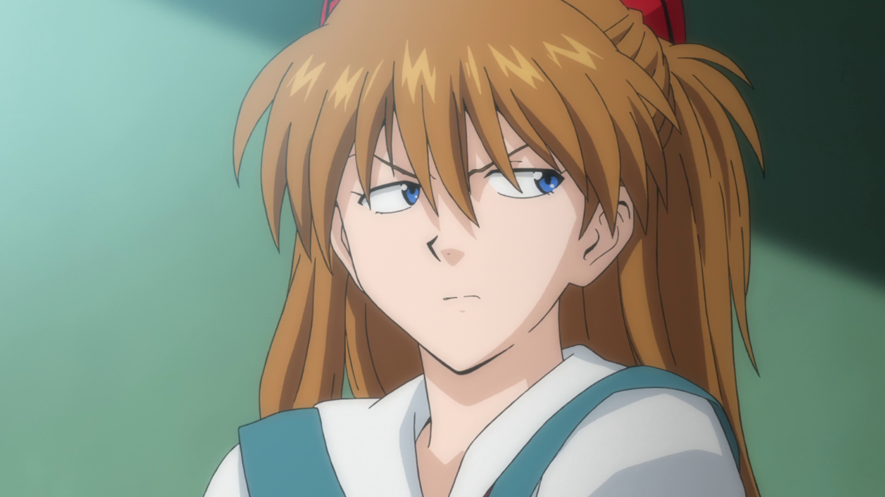</td>
      <td width="30%" valign="top">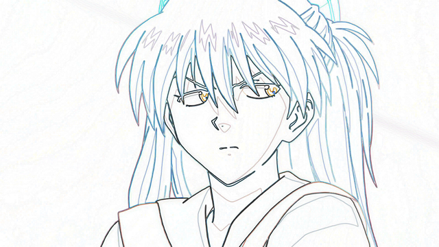</td>
      <td width="30%" valign="top">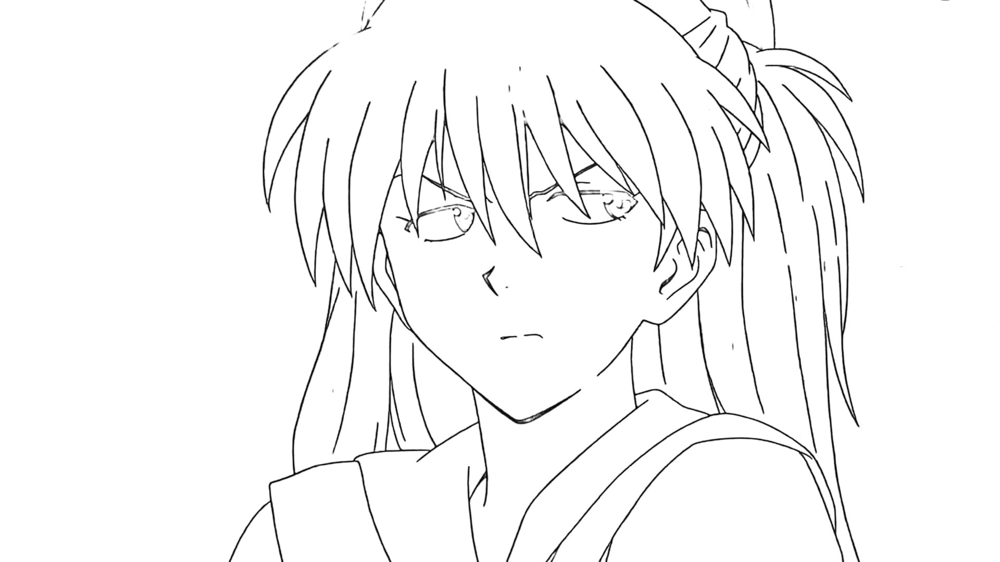</td>
    </tr>
    <tr>
      <td width="30%" valign="top"></td>
      <td width="30%" valign="top">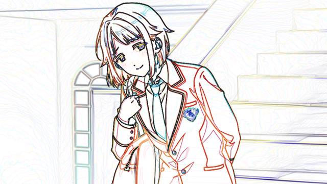</td>
      <td width="30%" valign="top">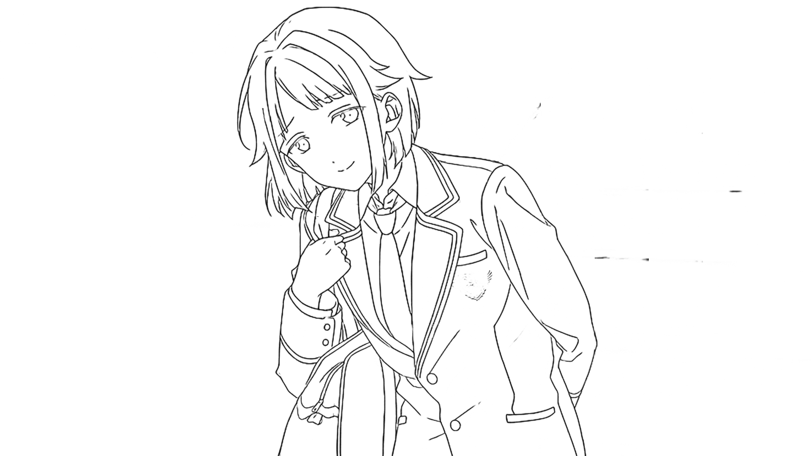</td>
    </tr>
    <tr>
      <td align="center">raw</td>
      <td align="center">edge detection</td>
      <td align="center">lines</td>
    </tr>
  </tbody>
</table>

##### What can I get?

With this project you can build your dataset and train your model. Here are some data samples(see below) can be obtained by simply extracting lines from **raw** illustration, and applying some heuristic algorithm from the toolset: **lines**, **bounding rect**, **polygon segmentation**, **mask segmentation**, **fill region segmentation**, **colorization decomposition(flat color)**, **region based color palette**, which can be used for almost all related deep learning tasks. 

<table>
  <tbody>
    <tr>
      <td width="25%" valign="top">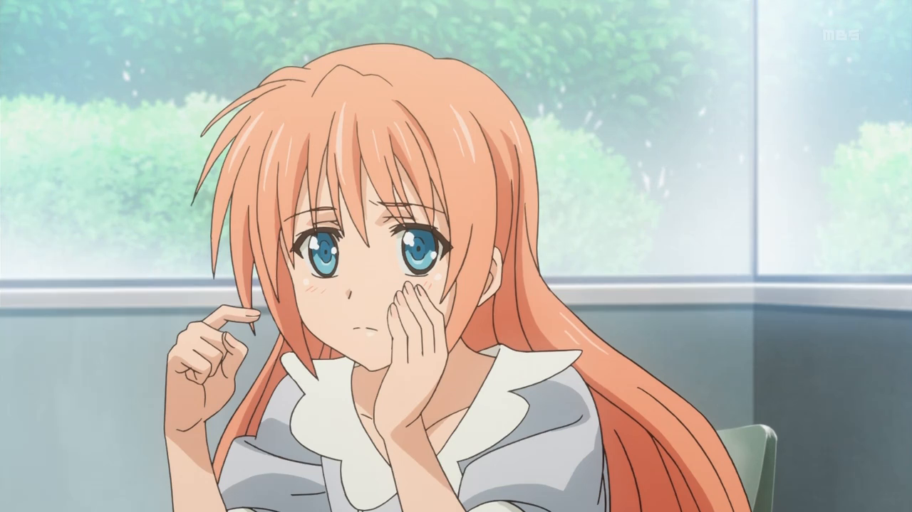</td>
      <td width="25%" valign="top">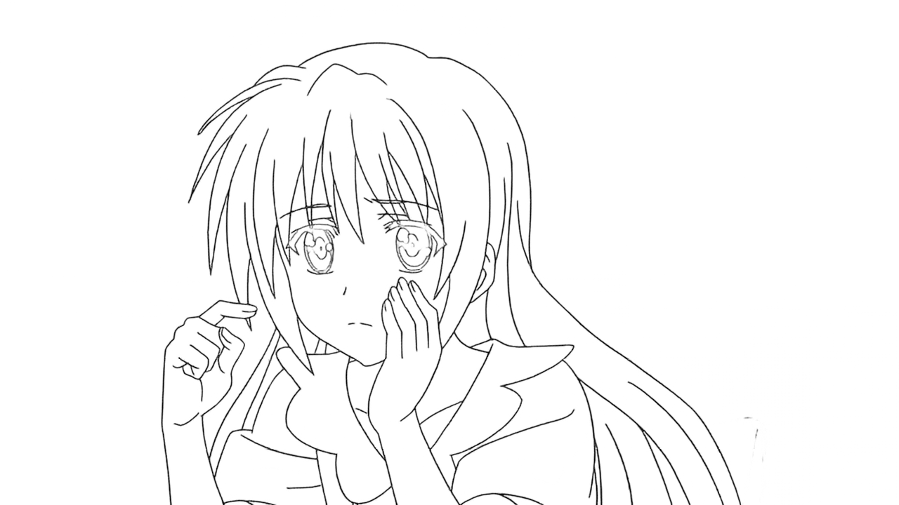</td>
      <td width="25%" valign="top"></td>
      <td width="25%" valign="top"></td>
    </tr>
    <tr>
      <td align="center">raw</td>
      <td align="center">lines</td>
      <td align="center">bounding rect</td>
      <td align="center">mask</td>
    </tr>
    <tr>
      <td width="25%" valign="top">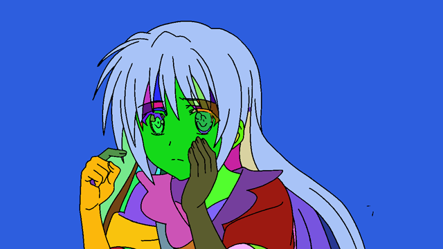</td>
      <td width="25%" valign="top">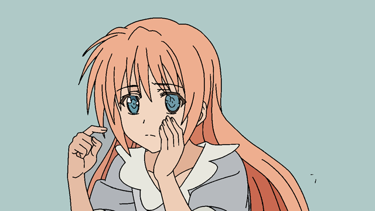</td>
      <td width="25%" valign="top">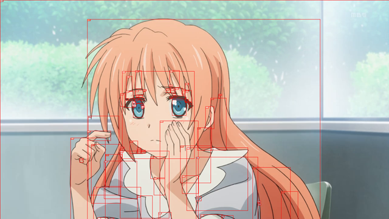</td>
      <td width="25%" valign="top">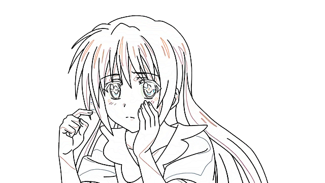</td>
    </tr>
    <tr>
      <td align="center">fill region</td>
      <td align="center">flat color</td>
      <td align="center">color palette</td>
      <td align="center">shade lines</td>
    </tr>
  </tbody>
</table>

##### How can I use the dataset? 

By simply extracting line from your own raw images, you can create color-lines dataset. With this dataset, you can train your own LineDistiller or a new colorization model. Lines from our project are more closer to lines from human than other algorithm such as tranditional edge detector, and these will significantly boost performance of your colorization model when deals with input from the wild. Fill region and palette can be obtained with help from [LineFiller](https://github.com/hepesu/LineFiller) and [colorgram.py](https://github.com/obskyr/colorgram.py), which might help in some new colorization research, such as region-based colorization. Furthermore, you can get information about shading with flat color, with color-flatcolor or lines-shading dataset, you can create model that shade lines([LineShader](https://github.com/hepesu/LineShader)) or add effect to the flat color.

Also You can only play with the lines, such tasks including line quality improvement(gap closing, threshold), line stylization. Some lines related model can be found at [LineNormalizer](https://github.com/hepesu/LineNormalizer), [LineCloser](https://github.com/hepesu/LineCloser), [LineRelifer](https://github.com/hepesu/LineRelifer).

Besides some tasks related to production, you can create models to detect anime charater and make segmentation, like removebg or anti-covering bullet screen for anime. Just have fun with your dataset!

If you have problem, please open an issue on GitHub. I would love to know if you're using this to create amazing work. And if you find this help, please give me a :star:!

## Dependencies
* Keras2 (Tensorflow1 backend)
* Pytorch 1.5
* OpenCV3
* colorgram.py

## Usage
### Installation
1. Clone the repo, **!! Pytorch version is under the pytorch branch**.
```
git clone https://github.com/hepesu/LineDistiller.git
```
2. Install dependencies. The model is relatively small, so you can play it with CPU. But we recommend using GPU(CUDA) for training.
### Extract Lines
1. Download the model from release and put it in the same folder with code, then rename to `model.h5` for Keras or `model.pth` for pytorch.
2. Put raw images into folder `input`.

  * `input`, contains the images for prediction
  * `output`, contains the output results from prediction
3. Run `predict.py` for prediction. `predict_block.py` provide prediction by block to solve memory problem, but it might introduce some problem when blocks have significant difference.

### Create Your Dataset
1. Use some tools to extract frames from anime. Here we use FFmpeg as example.
```
ffmpeg -i ANIME_FILE_PATH -vf select='gt(scene\,0.125)' -vsync vfr FRAMES_FILE_PATH
```
2. Copy them to `input` directory under project folder, or you can set `FRAMES_FILE_PATH` as `input` directory, then run `predict_block.py` . You can play with parameters in code to get better performance.
```
python predict_block.py
```
3. Create dataset as you want. Default code only output raw, lines, masks, please see the code.
```
python dataset_utils.py
```
4. Manully clean up you dataset, and train new models with the dataset :tada:.

The code for the toolset is in `utils`, run `mask.py` `fill.py` `misc.py`, to see the result, change implementation in them to get better result.

### Get Started with Your Dataset
Here we introduce training LineDistiller as example.

1. Prepare your color-lines dataset as section above. Put raw color images in `data/raw/0` and lines images in `data/contour/0` .
2. Make data argument to get 1.25x, 0.75x, 0.5x, 0.25x resized images.
```
python dataset_argument.py
```
3. Train the model.
```
python train.py
```

Next step, use U-net or Pix2pix with the dataset to get your colorization model.

## Models
**Models are released under CC BY-NC 4.0 .** Download them from below links:

* [LineDistiller Release Page](https://github.com/hepesu/LineDistiller/releases)
* [Google Drive](https://drive.google.com/drive/folders/1aVllrukeIqE0DQZXgVTT0q0iFs2dm5gF?usp=sharing)
* [BaiduPan](https://pan.baidu.com/s/1GnHMi2I0628NlEv3t5ulEw) [Code: kvyj]

#### Keras
* model_180102.h5
* model_180121.h5
#### Pytorch
* model_200728.pth

## Notes
* **The model only works with illustrations which have lines**.
* Images used for demonstration are collected from web. The copyright of these images belongs to their owner.
* Due to data limitation, complex background with line shape elements may give bad result.

## Citation
If you feel this helpful to your research, we ask you to kindly cite this project:
```
@misc{linedistiller,
    author = {Project HAT},
    title = {LineDistiller},
    url = {https://github.com/hepesu/LineDistiller},
}
```

## Examples
* [Weibo](http://photo.weibo.com/1252089801/talbum/detail/photo_id/4191853205742070/album_id/3557730510830920)
* [Zhihu](https://zhuanlan.zhihu.com/p/32597735)

From **Project HAT** by Hepesu With :heart:
___

# LineDistiller
[[English]](#linedistiller) **[中文]**

<p align="center">
 
</p>

想要开始绘画相关的深度学习探究？你所需的数据可以以此得到。LineDistiller是使用Keras/Pytorch，基于数据驱动的，面向动画、漫画及绘画的线条提取及数据集生成工具集。

## 总览
从二维图中提取高质量的线条对于深度学习工作及其在着色、草图简化和动画制作等方面的应用至关重要。我们从[Deep Extraction of Manga Structural Lines](http://exhibition.cintec.cuhk.edu.hk/exhibition/project-item/manga-lineextraction/)[1]和[sketchKeras](https://github.com/lllyasviel/sketchKeras)[2]中获得了灵感。我们的方法建立在[1]网络的基础上。为了获得更好的性能和更小的模型尺寸，将[1]中的残差块改为瓶颈残差块。我们也尝试了[1]和U-net的原始网络，像[2]的高通滤波结果输入的网络。其中，第一种模型在模型规模和结果上都较好。

<table>
  <tbody>
    <tr>
      <td width="30%" valign="top"></td>
      <td width="30%" valign="top"></td>
      <td width="30%" valign="top"></td>
    </tr>
    <tr>
      <td width="30%" valign="top"></td>
      <td width="30%" valign="top"></td>
      <td width="30%" valign="top"></td>
    </tr>
    <tr>
      <td align="center">色彩</td>
      <td align="center">边缘检测</td>
      <td align="center">线条</td>
    </tr>
  </tbody>
</table>

##### 这项目能做什么？

通过这个项目，您可以构建数据集并训练模型。这里有一些数据样本(见下文)可以通过简单地从**色彩**原图提取线条，并应用工具集的一些启发式算法得到：**线条**，**边界框**，**多边形分割**，**遮罩分割**，**填充区域分割**，**上色色分解(色彩平涂)**，**区域调色板**，可用于几乎所有相关的深度学习任务。

<table>
  <tbody>
    <tr>
      <td width="25%" valign="top"></td>
      <td width="25%" valign="top"></td>
      <td width="25%" valign="top"></td>
      <td width="25%" valign="top"></td>
    </tr>
    <tr>
      <td align="center">色彩</td>
      <td align="center">线条</td>
      <td align="center">边界框</td>
      <td align="center">遮罩</td>
    </tr>
    <tr>
      <td width="25%" valign="top"></td>
      <td width="25%" valign="top"></td>
      <td width="25%" valign="top"></td>
      <td width="25%" valign="top"></td>
    </tr>
    <tr>
      <td align="center">填充区域</td>
      <td align="center">色彩平涂</td>
      <td align="center">调色板</td>
      <td align="center">光影线</td>
    </tr>
  </tbody>
</table>

##### 数据集能做什么？

通过简单地从原始图像提取线条，你可以创建色彩-线条数据集。使用这个数据集，您可以训练自己的LineDistiller或新的上色模型。与传统边缘检测器等其他算法相比，我们项目中的线条更接近人类的线条，当处理来自真实的输入时，其将显著提高你的上色模型的性能。填充区域和调色板可以在[LineFiller](https://github.com/hepesu/LineFiller)和[colorgram.py](https://github.com/obskyr/colorgram.py)的帮助下获得，这有助于一些新的上色研究，比如基于区域的上色。此外，你可以获得关于使用色彩平涂和光影的信息，通过色彩-色彩平涂或线条-光影数据集，可以创建光影模型([LineShader](https://github.com/hepesu/LineShader))或为平涂添加效果。

此外，你可以只使用线条。这类任务包括线条质量改进(补缝、阈值)、风格化。相关模型可以在[LineNormalizer](https://github.com/hepesu/LineNormalizer)、[LineCloser](https://github.com/hepesu/LineCloser)、[LineRelifer](https://github.com/hepesu/LineRelifer)找到。

除了一些与制作相关的任务，你还可以创建模型来检测动画人物并进行分割，比如制作为动画用的移除背景或防覆盖弹幕。更多用途待你探索。

如果你有问题，欢迎提Issue。此外，我非常乐意了解你借此实现的有趣工作。如果你感到此项目有帮助，不妨给我个:star:吧！

## 依赖
* Keras2 (Tensorflow1 backend)
* Pytorch 1.5
* OpenCV3
* colorgram.py

## 使用方法
### 安装
1. 复制项目到本地, **注意！Pytorch版本在pytorch分支**.
```
git clone https://github.com/hepesu/LineDistiller.git
```
2. 安装依赖。 模型较小，可以用CPU执行，推荐用GPU(CUDA)训练。
### 提取线条
1. 下载模型文件至目录下，并重命名为 `model.h5`(Keras) 或 `model.pth`(Pytorch) 。
2. 把预测输入图片放 `input` 。

  * `input`, 预测输入
  * `output`, 预测输出

3. 执行 `predict.py` 预测。`predict_block.py` 提供了基于块区域的预测，这可以解决大尺寸图片的内存问题，但是在差异较大的块间会产生瑕疵。

### 制作你的数据集
1. 使用工具提取动画中的帧，此处以FFmpeg为例。
```
ffmpeg -i ANIME_FILE_PATH -vf select='gt(scene\,0.125)' -vsync vfr FRAMES_FILE_PATH
```
2. 复制提取结果至 `input` 目录，也可以直接将 `FRAMES_FILE_PATH` 设为 `input` 的目录， 之后执行 `predict_block.py` 。调整代码内的参数以获取最好的性能。
```
python predict_block.py
```
3. 创建你需要的数据集。默认代码只输出色彩、线条及遮罩，详情请见代码。
```
python dataset_utils.py
```
4. 手动清理数据，并训练你想要的模型 :tada:。

### 从头开始训练你的模型
以训练LineDistiller为例介绍数据的使用。

1. 根据上文构建你的色彩-线条数据集。色彩原图放置于 `data/raw/0` ，线条放置于 `data/contour/0` 。
2. 执行数据扩增，得到 1.25x, 0.75x, 0.5x, 0.25x 缩放的图片。
```
python dataset_argument.py
```
3. 训练模型。
```
python train.py
```

下一步，使用U-net或Pix2pix训练一个上色模型。

## 模型
**模型许可为 CC BY-NC 4.0 .** 可以通过以下链接获得：

* [LineDistiller Release Page](https://github.com/hepesu/LineDistiller/releases)
* [Google Drive](https://drive.google.com/drive/folders/1aVllrukeIqE0DQZXgVTT0q0iFs2dm5gF?usp=sharing)
* [百度盘](https://pan.baidu.com/s/1GnHMi2I0628NlEv3t5ulEw) [提取码: kvyj]

#### Keras
* model_180102.h5
* model_180121.h5
#### Pytorch
* model_200726.pth

## 注意
* **模型只对有线条的图画有效**。
* 展示图片来自网络，版权归其所有者。
* 受限于数据，复杂的线状元素背景会导致很差的结果（真）。

## 引用
如果本项目对你的研究有帮助，请慷慨地引用：
```
@misc{linedistiller,
    author = {Project HAT},
    title = {LineDistiller},
    url = {https://github.com/hepesu/LineDistiller},
}
```

## 更多案例
* [微博](http://photo.weibo.com/1252089801/talbum/detail/photo_id/4191853205742070/album_id/3557730510830920)
* [知乎](https://zhuanlan.zhihu.com/p/32597735)

From **Project HAT** by Hepesu With :heart:
___
**Project HAT** 提供有关影视及动画制作相关的咨询及开发服务，详情请联系hatsuame[AT]gmail.com 。