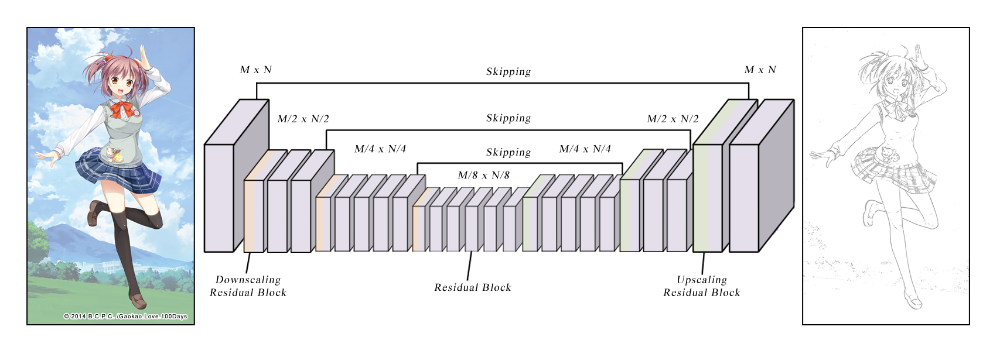

# LineDistiller

 

A data-driven **line extractor** for 2D anime, manga and illustration using Keras.

## Overview
Extraction of high quality lines from 2D illustration is very crucial for further deep learning work and its application such as colorization, sketch simplication and animation. This work was started for solving this basic problem and we received inspiration from [Deep Extraction of Manga Structural Lines](http://exhibition.cintec.cuhk.edu.hk/exhibition/project-item/manga-line-extraction/) [1] and [sketchKeras](https://github.com/lllyasviel/sketchKeras) [2]. Our approach build upon network in [1]. The residual block in [1] was changed to bottleneck residual block for better performance and less model size. We also tried original network in [1] and U-net like encoder-decoder network with highpass input like [2]. Among these models, the first model are better in both model size and result.

## Dependencies
* Keras2 (Tensorflow backend)
* OpenCV3

## Usage
1. Set up directories.

The data should be organized into directories. The directory tree is:

  * `data/raw`, contains the images for train
  * `data/contour_s`, contains the line images for train
  * `data/v_raw`, contains the images for validation
  * `data/v_contour_s`, contains the line images for validation
  * `data/predict`, contains the images for preidction
  * `data/result`, contains the output results from preidction

`train.py` uses keras `ImageDataGenerator`, please organize sub folders as it needs

2. Download the model from release and put it in the same folder with code, then rename to `model.h5`.

3. Run `train.py` for train and `predict.py` for preidction.

## Models
**model_180102.h5**: Model trained using MSE loss with private dataset(will be public soon) for 25 epochs, loss ~0.001.

## Notes
* **The model only works with illustrations which have lines**. It will not perform edge detection, it just extracts lines from the original image. So it can ignore edges between different color fills and shadings (often cause gradient changes).
* Due to small dataset, the performance for general illustration could be worse. The model should be trained with argumented data contains different brightness and line width.
* The model can also extract text in dark color from image with complex background, see example in zhihu link.
* Parameter **EPOCHS** and **BATCH_SIZE** in `train.py` have been optimized.
* Using **tanh** as activation of last layer results better performance but may cause some artifacts.
* Prefered sizes of image are HD (1920x1080) and SD (1280x720). Memory cost for HD image may be heavy.
* The input is preprocessed and the output is postprocessed for better result.

## Further Work
* Train on large and various dataset.
* Classify lines and output them with classes such as boundray line, shading line.
* Smaller structure and model size for running in browser.

## Examples
[Weibo](http://photo.weibo.com/1252089801/talbum/detail/photo_id/4191853205742070/album_id/3557730510830920)
[Zhihu](https://zhuanlan.zhihu.com/p/32597735)

From **Project HAT** by Hepesu With :heart:
